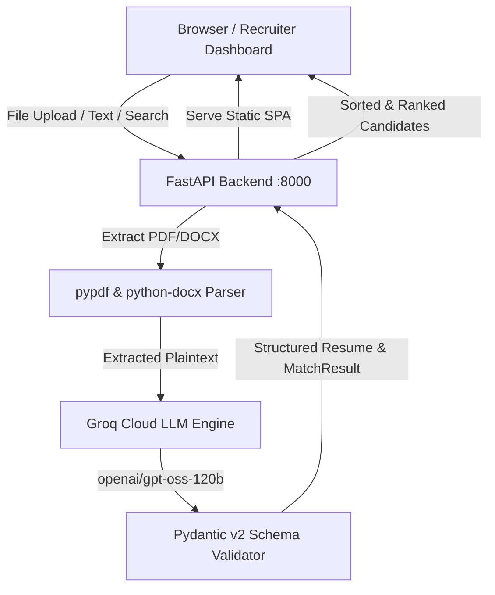

# 🎯 TalentMatch AI — Intelligent Resume Parser & Screening Platform

An enterprise-grade, full-stack AI platform that automates resume screening, candidate intelligence, and role matching against job descriptions using **Groq LLMs (`openai/gpt-oss-120b`)**, **Pydantic v2 validation schemas**, and **React**.

---

## 🌟 Key Capabilities

- **Automated Document Extraction:** Directly extracts plain text from multi-page Adobe PDF (`.pdf`) and Microsoft Word (`.docx`) documents using `pypdf` and `python-docx`.
- **Structured LLM Extraction:** Extracts candidate entities (education, work history, projects, contact info, and skills) strictly adhering to Pydantic v2 JSON schemas.
- **Role Fit Scoring & Recruiter Assessment:** Benchmarks each candidate against the Amazon SDE-I job specification, computing a weighted match score (0–100%), matching competencies, missing qualifications, and an executive recruiter assessment.
- **Production Dashboard:** Dark-mode interface built with React, featuring circular SVG score gauges, dual-column skill matrices, search by skill/name, tier filters, candidate shortlisting, and candidate dossier export (JSON).
- **Live Drag-and-Drop File Upload:** Direct in-browser upload for `.pdf` and `.docx` resumes with real-time Groq evaluation and live ranking updates.
- **Single-Container Deployment:** Unified FastAPI backend that serves both REST APIs and the compiled React single-page application from a single port.

---

## 🏗️ Architecture



---

## 🚀 Quick Start (Local)

### Prerequisites
- Python >= 3.11
- Node.js >= 18
- Groq API Key ([Get one free from Groq Console](https://console.groq.com/keys))

### 1. Clone & Navigate
```bash
cd week1/day5
```

### 2. Environment Configuration
Create a `.env` file in `week1/day5`:
```env
GROQ_API_KEY=gsk_your_actual_groq_api_key_here
PORT=8000
```

### 3. Run with One Click (Windows)
Double-click `start.bat` or run:
```powershell
.\start.bat
```

### 4. Or Run Manually with Python & FastAPI
```bash
# Sync dependencies
uv sync

# Start the full-stack server
.venv\Scripts\python.exe server.py
```
Open **[http://127.0.0.1:8000](http://127.0.0.1:8000)** in your browser.

---

## 💻 Development Mode (Frontend Hot-Reloading)

To develop with live React hot-reloading:

```bash
# Terminal 1: Start Backend API Server
.venv\Scripts\python.exe server.py

# Terminal 2: Start Vite Dev Server (Proxies /api to port 8000)
cd frontend
npm install
npm run dev
```
Open **[http://127.0.0.1:5173](http://127.0.0.1:5173)**.

---

## ☁️ Deployment Guide

### Option 1: Render.com (Recommended)
This repository includes a `render.yaml` configuration file for 1-click deployment.

1. Push this directory to your GitHub/GitLab repository.
2. Go to [Render Dashboard](https://dashboard.render.com/) -> **New** -> **Blueprint**.
3. Connect your repository. Render will automatically detect `render.yaml` and build the multi-stage `Dockerfile`.
4. In Environment Variables, set:
   - `GROQ_API_KEY` = `your_groq_api_key`
5. Click **Deploy**. Your app will be live at `https://your-app-name.onrender.com`.

---

### Option 2: Railway.app
1. Go to [Railway.app](https://railway.app/) and create a **New Project**.
2. Select **Deploy from GitHub repo**.
3. In Project Settings -> **Variables**, add:
   - `GROQ_API_KEY` = `your_groq_api_key`
   - `PORT` = `8000`
4. Railway will automatically build the `Dockerfile` or use `Procfile`.
5. Generate a public domain under Networking.

---

### Option 3: Docker (Any VPS, AWS ECS, GCP Cloud Run, or Fly.io)

Build the production image locally or on a cloud server:

```bash
# Build the Docker image
docker build -t talentmatch-ai .

# Run the container
docker run -d \
  -p 8000:8000 \
  -e GROQ_API_KEY="your_groq_api_key" \
  --name talentmatch \
  talentmatch-ai
```
Your full-stack application will be accessible on `http://<your-server-ip>:8000`.

---

### Option 4: Vercel (Frontend Only)
To deploy only the React frontend on Vercel:
1. Navigate to the `frontend/` directory in Vercel.
2. Deploy using framework preset **Vite**.
3. `frontend/vercel.json` ensures SPA rewrites work seamlessly.

---

## 📡 REST API Documentation

### `GET /api/health`
Checks server health, Groq API key configuration, and candidate counts.
```bash
curl http://127.0.0.1:8000/api/health
```

### `GET /api/candidates`
Returns all evaluated candidates sorted by overall match percentage.
```bash
curl http://127.0.0.1:8000/api/candidates
```

### `POST /api/upload-resume`
Uploads a `.pdf` or `.docx` file, extracts text, runs Groq evaluation, and returns candidate data.
```bash
curl -X POST http://127.0.0.1:8000/api/upload-resume \
  -F "file=@/path/to/resume.pdf"
```

### `POST /api/evaluate-text`
Evaluates raw resume text against the target job specification.
```bash
curl -X POST http://127.0.0.1:8000/api/evaluate-text \
  -H "Content-Type: application/json" \
  -d '{"candidate_name": "John Doe", "resume_text": "Experienced C++ developer with AWS..."}'
```

### `GET /api/job-description`
Returns active job role requirements and Pydantic schema breakdown.
```bash
curl http://127.0.0.1:8000/api/job-description
```

### `POST /api/reset-candidates`
Resets the in-memory database to the baseline Day 5 cohort.
```bash
curl -X POST http://127.0.0.1:8000/api/reset-candidates
```

---

## 📁 Repository Structure

```text
├── Dockerfile                  # Multi-stage container build (Node -> Python runner)
├── Procfile                    # Process definition for Railway / Heroku
├── README.md                   # Project documentation & deployment guide
├── pyproject.toml              # Python project metadata and dependencies
├── render.yaml                 # 1-click deployment blueprint for Render.com
├── resume_parser.py            # Original CLI parsing script with auto-retry
├── server.py                   # Production FastAPI server & REST API
├── start.bat                   # 1-click Windows runner
├── start.sh                    # Linux / macOS runner
├── uv.lock                     # Locked Python dependencies
├── resumes/                    # Sample applicant resumes (.pdf and .docx)
│   ├── Ashish Raj 24PCS007 (1) - Ashish Raj.pdf
│   ├── Resume for Freshers - Priyanshu Singh.docx
│   ├── abhay resume new - Abhay Singh.pdf
│   └── anshit verma resume word - Anshit Verma.docx
└── frontend/                   # React + Vite web dashboard
    ├── package.json
    ├── vite.config.js
    ├── index.html
    └── src/
        ├── App.jsx             # Main dashboard layout, state & filters
        ├── App.css             # Responsive styling & design tokens
        ├── components/
        │   ├── Navbar.jsx
        │   ├── StatsOverview.jsx
        │   ├── CandidateCard.jsx
        │   ├── CandidateModal.jsx
        │   ├── JobDescriptionDrawer.jsx
        │   └── ResumeAnalyzerModal.jsx
        └── data/
            └── candidateData.js
```

---

## 🛡️ Security & Privacy Note
Never commit your `.env` file or API keys to version control. The application automatically loads `GROQ_API_KEY` from system environment variables or `.env`.
